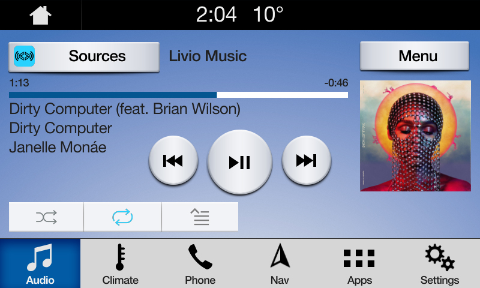

## Music Apps

When creating a music app for SDL the app should include as much of the native apps functionality as possible. If your app requires a user name and password to be used then the user should be informed for this instead of the user just being unable to access the apps functionality. Please refer to the `Displaying Information` section.

#### Basic Commands

Your Music app should contain such basic functionality as `Play`, `Pause`, and `Resume`. You can use build in controls for these features by calling the `subscribeButton` RPC. This will allow you to not only create buttons on the infotainment system but also be informed when the user presses hard buttons, which might be placed on the steering wheel. It is important to also add voice control capabilities for these functions. To add a voice command use the `addCommand` RPC but omit the `menuParams` argument. This will create a voice command without creating an item in the menu.
###*Add link to AddCommand section*

#### Display Information
Your app should display things like song name, artist name, and optionally the album name. It is encouraged to use the following layout of information on the screen:

TextField  | Information
-----------|-------------
mainField1 | Song
mainField2 | Artist
mainField3 | Album

It is encouraged to show static images of the album art, however moving or interactive images are not allowed neither is the display of lyrics.

###*Add Link to DisplayInformation*
Below is an example of the Pandora home screen using the MainFields and displaying a graphic.

#### Using presets

If your app features different stations or streams you should consider allowing the user to save these stations to preset buttons. To receive notifications about preset button presses please use the `subscribeButton` RPC with the respective presets as arguments. On some SDL implementations you will be able to change the text on a preset button. To change this text use the `customPresets` array in the `show` RPC.

#### Managing Audio
When you receive the `NOT_AUDIBLE` state you should pause the audio and resume when you receive `AUDIBLE`. The pausing and resuming should be independent on the current `HMILevel` state.
